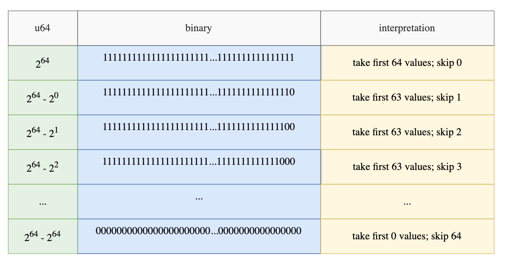

# Filter

A frequently performed task in a DBMS is row filtering, which involves applying a predicate (boolean mask) to selectively filter rows.

This is what the `Filter` function does. `Filter` is a method on each `ChunkedArray` that takes a `BooleanChunked` and returns a filtered `ChunkedArray`.

For example:

```rust
let array = ChunkedArray::new("foo", [1, 2, 3, 4]);
let predicate = ChunkedArray::new("pred", [true, false, false, true]);
let filtered = array.filter(&predicate);
// Output: ChunkedArray("foo", [1, 4]);
```

### The Filter-Trick

An optimization that Polars uses for filtering is “the filter trick”, as Ritchie calls it [in his blog](https://www.ritchievink.com/blog/2021/02/28/i-wrote-one-of-the-fastest-dataframe-libraries/).

The idea originates from the observation that having to iterate each bit in the filter mask and having to copy each value to the output array one by one is slow.

Oftentimes, there are sequences of consecutive values that can be skipped. For instance, if there are 1000 consecutive 0s, it is preferable to skip them rather than iterating over each one individually.

The filter-trick first loads the bit array into an any integer type, such as `u64`. By doing so, we know that the numbers can range from 64 consecutive 1s ( `11...1`s) to 64 consecutive 0s (`00...0`)s.

If the integer belongs to any of the following entries, then we can do a `memcpy` to efficiently copy the value to the output. For example, if the binary is equivalent to 2^64 - 2^2, then we can just copy the first `63` values into the output array.



If you want to look at the code, the filter-trick lives inside the Arrow2’s [filter function](https://github.com/jorgecarleitao/arrow2/blob/eed5ebb2b0d18dfbcce363f5d212410f52a49333/src/compute/filter.rs#L249). The algorithm first [loads the bit array into `u64` integers](https://github.com/jorgecarleitao/arrow2/blob/eed5ebb2b0d18dfbcce363f5d212410f52a49333/src/compute/filter.rs#L89).

It then checks if the loaded integer falls in any of the entries above. This is achieved by [getting the leading ones in the number](https://github.com/jorgecarleitao/arrow2/blob/eed5ebb2b0d18dfbcce363f5d212410f52a49333/src/compute/filter.rs#L103) and checking if that is equal to the [total number of 1s in the number](https://github.com/jorgecarleitao/arrow2/blob/eed5ebb2b0d18dfbcce363f5d212410f52a49333/src/compute/filter.rs#L102). If it is, then the [first N elements can be copied to the destination](https://github.com/jorgecarleitao/arrow2/blob/eed5ebb2b0d18dfbcce363f5d212410f52a49333/src/compute/filter.rs#L108).

As stated in Ritchie’s blog, if the predicate bit array alternates between boolean values, such as `[true, false, true, false, ..., true, false]`, then the trick has an overhead.
