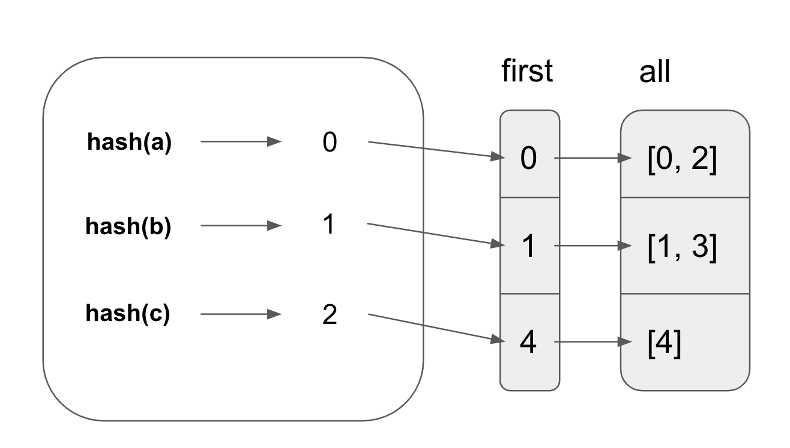

# Groupby

GroupBy is an operation that allows people to group records based on certain attributes and perform aggregations on those groups. It is often used in combination with aggregate functions like `SUM`, `COUNT`, etc to summarize information for each group.

Here’s an example of `GroupBy`:

```rust
let df = df![
    "name" => ["a", "b","a", "b", "c"],
    "points" => [1, 2, 1, 3, 3]
]
let res = df
  .lazy()
  .groupby(vec!["name"])
  .agg(vec![col("points").sum()])
  .collect();
```

In this example, we group rows by the `name` column and aggregate the `sum` for each group. This would yield the dataframe:

<div float="left" margin-left="0">

| name | points |
| :--- | :----- |
| a    | 2      |
| b    | 5      |
| c    | 3      |

</div>

### GroupProxy

When developers perform `df.groupby(...)`, they actually get back a `GroupProxy`, a temporary data structure that stores information about which rows belong to which groups. The most common variant of GroupProxy is GroupsIdx. This is its definition:

```rust
pub struct GroupsIdx {
    first: Vec<u32>,
    all: Vec<Vec<u32>>,
}
```

The indices of the rows belonging to the same group are stored together in the `all` vectors. The first index of each group is stored in the `first` vector.

If we look at the example:

```rust
let df = df![
    "name" => ["a", "b","a", "b", "c"],
    "points" => [1, 2, 1, 3, 3]
]
let group_idx = df
  .lazy()
  .groupby(vec!["name"]);
```

In the example provided above, the `GroupIdx` is:

```rust
{
	first: [0, 1, 4],
	all: [
		[0, 2], // indices of rows with col("name") = "a"
		[1, 3], // indices of rows with col("name") = "b" 
		[4].    // indices of rows with col("name") = "c"
	]
}
```

If there are multiple `groupby` keys, the same logic applies:

```rust
let df = df![
    "name" => ["a", "b","a", "b", "c"],
    "points" => [1, 2, 1, 3, 3]
]
.unwrap();
let groupby = df.groupby(vec!["name", "points"]).unwrap();
```

In this example, the `GroupProxy` is:

```rust
{
	first: [0, 1, 3, 4],
	all: [
		[0, 2], // indices where col("name") = "a" & col("points") = 1
		[1],    // indices where col("name") = "b" & col("points") = 2
		[3],    // indices where col("name") = "b" & col("points") = 3
		[4]     // indices where col("name") = "c" & col("points") = 3
	]
}
```

### Hash Group By

Polars uses hash group by to compute the GroupProxy for a dataframe given a set of group keys. This is very similar to the parallel hash join algorithm presented earlier. The overall idea is to use a hash table to group indices with the same group by keys.

Polars first computes the hashes for the `by` columns with the vectorized hashing technique that Hash Join uses.

Next, Polars parallelizes the creation of hash tables with the same modulo trick mentioned in the [last section](https://brianshih1.github.io/mini-dataframe/dataframe/join.html). Every thread traverses all hashes and ignores the ones that doesn’t belong to that thread.

Instead of storing the indices inside the hash table, the hash table stores the index of the `all` vector. The algorithm [iterates through the hashes](https://github.com/pola-rs/polars/blob/5ee93f42cc058c8c2ab6b20876ffc5f39e23b665/polars/polars-core/src/frame/groupby/hashing.rs#L500). If there is a matching entry in the hash table for a group key, it uses the index stored in the hash table to find the other indices in the same group in `all` and [adds itself to it](https://github.com/pola-rs/polars/blob/5ee93f42cc058c8c2ab6b20876ffc5f39e23b665/polars/polars-core/src/frame/groupby/hashing.rs#L527). Otherwise, it adds a new entry to the hash table and [adds itself to the `first` and `all` vectors](https://github.com/pola-rs/polars/blob/5ee93f42cc058c8c2ab6b20876ffc5f39e23b665/polars/polars-core/src/frame/groupby/hashing.rs#L518).

Given the earlier example:

```rust
let df = df![
    "name" => ["a", "b","a", "b", "c"],
    "points" => [1, 2, 1, 3, 3]
]
let res = df
  .lazy()
  .groupby(vec!["name"])
```

The figure below shows that the hash table stores the indices that correspond to the `first` and `all` tables.



### Parallel Flattening

Since Polars parallelizes the grouping of rows, each thread creates a `first` and `all` vector. Thus, we end up with `Vec<(Vec<IdxSize>, Vec<Vec<IdxSize>>)>`. To create the `GroupProxy`, we need to [flatten the vector](https://github.com/pola-rs/polars/blob/f566963f526a11585805088c96e579045a0a2b79/polars/polars-core/src/frame/groupby/hashing.rs#L19).

The goal of flattening is to turn `Vec<Vec<...>>` into `Vec<...>`. Copying the elements one by one into the output vector may be slow when the number of elements is large. Polars utilizes available threads to flatten the array in parallel.

Polars guarantees that the output vector will not reallocate by [initializing the output vector’s capacity to the exact size it will end up in](https://github.com/pola-rs/polars/blob/5ee93f42cc058c8c2ab6b20876ffc5f39e23b665/polars/polars-core/src/frame/groupby/proxy.rs#L60). This makes it safe to parallelize the copying of individual vectors into the output vector. The capacity can be computed by [summing up the sizes of the smaller vectors](https://github.com/pola-rs/polars/blob/5ee93f42cc058c8c2ab6b20876ffc5f39e23b665/polars/polars-core/src/frame/groupby/proxy.rs#L51).

Each smaller vector needs to know the address to copy the values into. The offsets are [pre-computed](https://github.com/pola-rs/polars/blob/5ee93f42cc058c8c2ab6b20876ffc5f39e23b665/polars/polars-core/src/frame/groupby/proxy.rs#L52) and the final address is derived from: `first.as_mut_ptr().add(offset)`.

In Rust, mutable pointers does not implement the `Sync` trait so Rust will complain that `*mut u32` cannot be shared between threads safely when using `Rayon`. Polars [wraps the mutable pointer with a `SyncPtr` struct](https://github.com/pola-rs/polars/blob/5ee93f42cc058c8c2ab6b20876ffc5f39e23b665/polars/polars-core/src/frame/groupby/proxy.rs#L61). The `SyncPtr` struct allows sending pointers to other threads when the developer is confident that the pointer will point to valid address.

```rust
pub struct SyncPtr<T>(*mut T);
unsafe impl<T> Sync for SyncPtr<T> {}
unsafe impl<T> Send for SyncPtr<T> {}
```

Finally, Polars uses `std::ptr::copy_nonoverlapping` to [copy value from the smaller Vecs to the new Vec](https://github.com/pola-rs/polars/blob/5ee93f42cc058c8c2ab6b20876ffc5f39e23b665/polars/polars-core/src/frame/groupby/proxy.rs#L73).

I will talk about how Groupby is composed with aggregate functions in the LazyFrame section.
