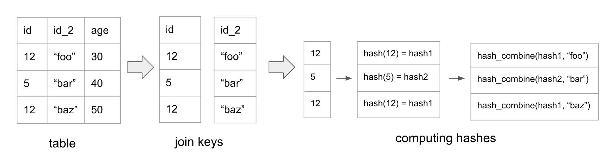
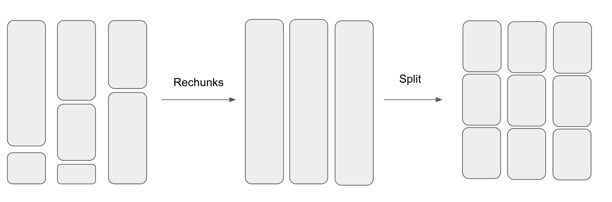
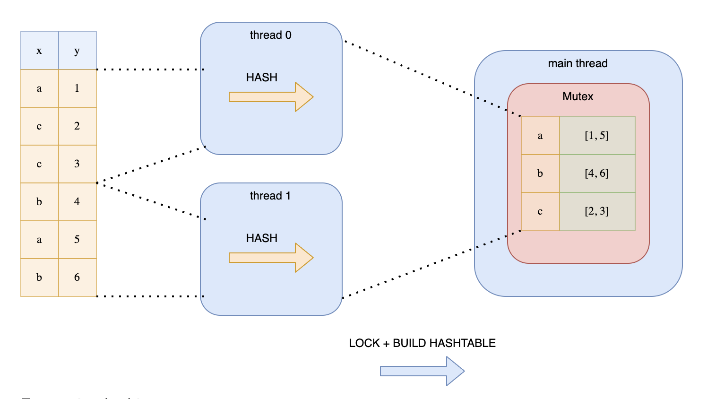
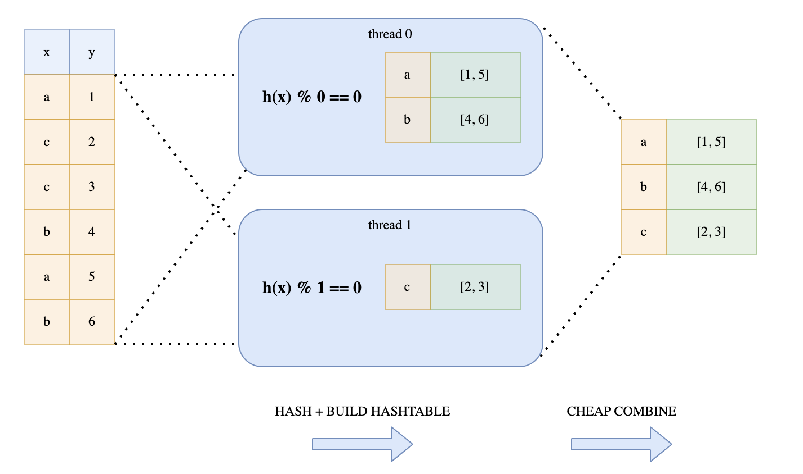
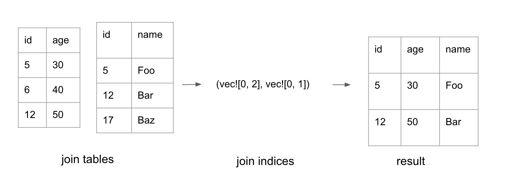

# Join

Polars uses a lock-free parallel hash join algorithm. The technique Polars uses is similar to the hash join algorithm presented in [this CockroachDB blog](https://www.cockroachlabs.com/blog/vectorized-hash-joiner/).

### Hash Join Refresher

The hash join algorithm consists of the following steps:

- **Hash the join keys**: compute the hash for each row in the two join tables.
- **Build phase**: compute the hash table for the smaller table. The key of the hash table is the join keys and the value is the index of the row
- **Probe phase**: for every row in the larger table, check if there’s a row in the hash table with matching join keys, If there is, add it to the result set.

Now, let’s talk about Polars’ version of hash join.

### Hashing

Since Polars maintains data using a columnar format, Polars builds the hashes for the rows column-by-column to be CPU cache friendly.



The figure above showcases how hash values are computed. In the example, `id` and `id_2` are the join keys of the table.

First, we calculate the hash for the `id` column. Next, we merge the hash of the `id` column with the value from `id_2`, resulting in a new combined hash. In the event of a third join key, we would merge the computed hash with the value of the third join key.

In general, we compute the `hash` for the first column. Then we use `hash_combine(old_hash, value)` on the subsequent columns to compute the new hashes.

This algorithm allows Polars to perform simple for loops over each column which is fast. In contrast, performing row-by-row hashing for columnar data is unfriendly to the CPU.

In Polars, each `ChunkedArray` needs to implement the `[VecHasher` trait](https://github.com/pola-rs/polars/blob/main/polars/polars-core/src/hashing/vector_hasher.rs#L21). This means that each column type needs to have the ability to calculate its own hash and combine it with other hashes.

```rust
pub trait VecHash {
    /// Compute the hash for all values in the array.
    fn vec_hash(&self, _random_state: RandomState, _buf: &mut Vec<u64>);

    fn vec_hash_combine(&self, _random_state: RandomState, _hashes: &mut [u64]);
}
```

Since my toy Polars implementation supports 3 data types - `bool`, `i32`, and `Utf8`, I looked at the hash algorithms used by Polars for `vec_hash` and `vec_hash_combine` with these data types. Here is a summary:

**Integer**

- `vec_hash`: [AHash](https://docs.rs/ahash/latest/ahash/)
- `vec_hash_combine`: AHash

**Bool**

- `vec_hash`: default Rust’s hash method - SipHash 1-3
- `vec_hash_combine` - _boost_hash_combine

**Utf8**

- `vec_hash` - [xxh3](https://docs.rs/xxhash-rust/latest/xxhash_rust/xxh3/index.html) hash
- `vec_hash_combine` - [_boost_hash_combine](https://www.boost.org/doc/libs/1_55_0/doc/html/hash/reference.html#boost.hash_combine)

I didn’t look too deeply into why Polars chose these hash algorithms. But the author of Polars referenced [this blog](http://myeyesareblind.com/2017/02/06/Combine-hash-values/) which contains the performance analysis of different hash combine algorithms.

**Parallelizing computing hashes**

Polars parallelizes computing the hashes when the number of rows get large. Parallelizing work over a dataframe isn’t as straightforward as parallelizing work across a single array. This is because each `Series` is composed of a `ChunkedArray` which is made up of chunks of `Arrow2` arrays.

The number of chunks and the chunk sizes across the different Series are not aligned. So before splitting up the dataframe into N pieces, Polars first [aligns the chunks](https://github.com/pola-rs/polars/blob/main/polars/polars-core/src/utils/mod.rs#L186) by combining them [into a single chunk](https://github.com/pola-rs/polars/blob/main/polars/polars-core/src/frame/mod.rs#L483C27-L483C27) before splitting them into N chunks. This process is shown in the diagram below.




After splitting the dataframe into smaller dataframes, Polars then [uses Rayon to parallelize computing the hashes](https://github.com/pola-rs/polars/blob/f566963f526a11585805088c96e579045a0a2b79/polars/polars-core/src/hashing/vector_hasher.rs#L462).

### Building the Hash Table

After computing the hashes, we are finally ready to build the hash table. In Polars, the hash table’s type is `HashMap<IdxHash, Vec<Idx>` where `IdxHash` is:

```rust
struct IdxHash {
    // idx in row of Series, DataFrame
    pub idx: IdxSize,
    // precomputed hash of T
    pub hash: u64,
}
```

The `HashMap` stores indices instead of entire rows because it’s cheaper. It uses `IdxHash` as the key instead of Idx because different sets of join keys can have the same hash but different values. Thus, the hashmap stores both the hash and the index of the first unique row keys it encounters. When writing to the hash table, if the hash matches, it needs to [compare the df rows](https://github.com/pola-rs/polars/blob/f566963f526a11585805088c96e579045a0a2b79/polars/polars-core/src/frame/groupby/hashing.rs#L203) to check if the join keys are the same.

**Splitting Data to Multiple Threads**

To speed things up, Polars parallelizes the construction of the hash table.

But as stated in Ritchie’s [blog](https://www.ritchievink.com/blog/2021/02/28/i-wrote-one-of-the-fastest-dataframe-libraries/), we cannot simply split up the data amongst the threads. This is because the same keys may end up in different hash tables on different threads. This approach would require another synchronization phase to combine all the hash tables which is expensive.

Another approach is to split the data and wrap the hash table around a Mutex. Each thread would then acquire a lock before writing to the hash table. This is illustrated in Ritchie’s diagram:



This is not a good solution because the threads would be contending over the lock.

Instead, Polars uses a lock-free mechanism. Every thread would loop over the hashes. But depending on the hash value, each thread determines whether to add the hash into its hash map. This is determined by whether `hash value % thread number = 0`. This trick guarantees that all keys with the same value will end up in the same hash table. This technique is illustrated in Ritchie’s diagram:



Performing modulo on each hash may be expensive, especially for longer hashes. Polars avoid this by using a bitwise operation hack. This is the bitwise operation it performs:

```rust
(h.wrapping_add(thread_no)) & n_partitions.wrapping_sub(1) == 0
```

This optimization only works if `n_partitions` is a power of 2. This leverages the mathematical property that `n % 2^i = n & (2^i - 1)`. The `n_paritions` is computed with [this method](https://github.com/pola-rs/polars/blob/f566963f526a11585805088c96e579045a0a2b79/polars/polars-core/src/utils/mod.rs#L31) which computes the closest 2^n above the number of threads.

### Probe Phase

In the probe phase, Polars iterates through the hashes of the probe table. If there is a corresponding entry in the hash table, the indices for both tables are added to the result set. This forms a tuple of two lists with the same length: `(Vec<IdxSize>, Vec<IdxSize>)`. Each list represents indices in its respective table.

Polars also [uses Rayon to parallelize](https://github.com/pola-rs/polars/blob/f566963f526a11585805088c96e579045a0a2b79/polars/polars-core/src/frame/hash_join/multiple_keys.rs#L202) the probe phase. It divides the hashes for the probe table into N slices where N is the number of available threads.

### **Constructing the final table**



The probe phase generates a pair of join indices, as shown above. The final phase is to convert the join indices into the final dataframe.

Polars [parallelizes the work](https://github.com/pola-rs/polars/blob/f566963f526a11585805088c96e579045a0a2b79/polars/polars-core/src/frame/mod.rs#L1733) to filter each column by the indices. Each `ChunkedArray` may not store all its data in a single chunk. Therefore, when performing `.get(idx)`, we need to first compute which chunk it lives in, then compute the relative index for that chunk. The logic to compute the `chunk_idx` and the actual `idx` is in [this function](https://github.com/pola-rs/polars/blob/f566963f526a11585805088c96e579045a0a2b79/polars/polars-core/src/utils/mod.rs#L865).

After filtering each column by the indices, the columns can finally be composed together to form the final dataframe.

### Code References:

The entry point to Join is [here](https://github.com/pola-rs/polars/blob/f566963f526a11585805088c96e579045a0a2b79/polars/polars-ops/src/frame/join/mod.rs#L67). For [inner join](https://github.com/pola-rs/polars/blob/f566963f526a11585805088c96e579045a0a2b79/polars/polars-ops/src/frame/join/mod.rs#L250), it [calls](https://github.com/pola-rs/polars/blob/f566963f526a11585805088c96e579045a0a2b79/polars/polars-ops/src/frame/join/mod.rs#L254) [_inner_join_multiple_keys](https://github.com/pola-rs/polars/blob/f566963f526a11585805088c96e579045a0a2b79/polars/polars-core/src/frame/hash_join/multiple_keys.rs#L178) to compute the join indices. That method first [splits the df](https://github.com/pola-rs/polars/blob/f566963f526a11585805088c96e579045a0a2b79/polars/polars-core/src/frame/hash_join/multiple_keys.rs#L187). It then [computes the hashes](https://github.com/pola-rs/polars/blob/f566963f526a11585805088c96e579045a0a2b79/polars/polars-core/src/frame/hash_join/multiple_keys.rs#L190C54-L190C54) in parallel.

Next, it [creates the probe table](https://github.com/pola-rs/polars/blob/f566963f526a11585805088c96e579045a0a2b79/polars/polars-core/src/frame/hash_join/multiple_keys.rs#L194). During construction of the probe table, it loops over each hash and [determines if the hash belongs to the thread](https://github.com/pola-rs/polars/blob/f566963f526a11585805088c96e579045a0a2b79/polars/polars-core/src/frame/hash_join/multiple_keys.rs#L57). If it is, it [adds it](https://github.com/pola-rs/polars/blob/f566963f526a11585805088c96e579045a0a2b79/polars/polars-core/src/frame/hash_join/multiple_keys.rs#L59) to the local hash table.

After creating the probe table, it [probes the other relation](https://github.com/pola-rs/polars/blob/f566963f526a11585805088c96e579045a0a2b79/polars/polars-core/src/frame/hash_join/multiple_keys.rs#L202) to create the join indices. Finally, it [constructs the final table](https://github.com/pola-rs/polars/blob/f566963f526a11585805088c96e579045a0a2b79/polars/polars-ops/src/frame/join/mod.rs#L264) with the indices.
