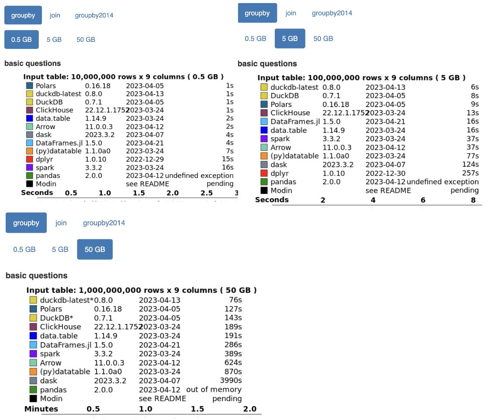

# Motivation

I recently spent a lot of time exploring the internals of [Polars](https://github.com/pola-rs/polars), the lightning-fast DataFrame library built on top of [Arrow2](https://github.com/jorgecarleitao/arrow2). I also built my own toy DataFrame library ([full source code available](https://github.com/brianshih1/mini-dataframe)) to make sure I understand the material better. I reused the same abstractions/APIs and reimplemented many algorithms used in Polars.

It all started when I came across a [blog post](https://www.ritchievink.com/blog/2021/02/28/i-wrote-one-of-the-fastest-dataframe-libraries/) by Ritchie Vink, the creator of Polars, titled "I wrote one of the fastest DataFrame libraries." The post highlighted Polars' impressive performance in benchmarks. I was inspired and wanted to see for myself what makes the library so fast.

Here are some screenshots from the [recent h20.ai benchmark](https://duckdb.org/2023/04/14/h2oai.html#results) for groupby queries conducted by DuckDB to showcase how fast Polars is.

In this blog, I will provide detailed explanations of how Polars implements Join, Groupby, Filter, and more.
